# INTERNET OF THINGS BASED SMART SYSTEMS 2024/25  
## Serra Smart - Progetto TIM

### Autori
- Matteo Santanocito 
- Silvia Garozzo   
- Giorgio Di Bartolo

---

## Indice
1. [Descrizione del Sistema](#descrizione-del-sistema)  
   1.1 [Schema Complessivo](#schema-complessivo)  
2. [Modulo ESP32](#modulo-esp32)  
3. [Sensore di Rilevamento Fumo/Gas (MQ-135)](#sensore-di-rilevamento-fumogas-mq-135)  
4. [Sensore di Umidità del Terreno (Moisture Soil)](#sensore-di-umidità-del-terreno-moisture-soil)  
5. [Sensore di Temperatura e Umidità dell'aria (DHT11)](#sensore-di-temperatura-e-umidità-dellaria-dht11)  
6. [Sistema di Controllo della Pompa e Relè](#sistema-di-controllo-della-pompa-e-relè)  
   - [Il Relè](#il-relè)  
   - [Schema di Collegamento del Relè e della Pompa](#schema-di-collegamento-del-relè-e-della-pompa)  
   - [Il Level Shifter](#il-level-shifter)  
7. [Implementazione su ThingsBoard](#implementazione-su-thingsboard)  
   - [Setup del Dispositivo ESP32](#setup-del-dispositivo-esp32)  
   - [Gestione dell’Attributo Shared](#gestione-dellattributo-shared)  
   - [Registrazione delle Telemetrie](#registrazione-delle-telemetrie)  
   - [Setup della Dashboard](#setup-della-dashboard)  
   - [Dashboard](#dashboard)  
8. [Struttura del Codice ESP32 (Descrizione)](#struttura-del-codice-esp32-descrizione)  
9. [Struttura del Codice Bot Telegram (Descrizione)](#struttura-del-codice-bot-telegram-descrizione)  

---

## Descrizione del Sistema
L’architettura della serra è stata progettata per garantire un **monitoraggio accurato** delle condizioni ambientali e un **controllo automatizzato** dell’irrigazione. Il sistema include i seguenti componenti principali:

- **Modulo Wi-Fi ESP32**: responsabile della raccolta dati e della connessione alla rete.  
- **Sensore di rilevamento fumo/gas (MQ-135)**: per la protezione antincendio.  
- **Sensore di umidità del terreno (Moisture Soil)**: per monitorare le condizioni del terreno.  
- **Sensore di temperatura e umidità (DHT11)**: per monitorare le condizioni ambientali.  
- **Pompa per l’acqua (RS360SH)**: utilizzata per l’irrigazione.  
- **Relè**: necessario per attivare e controllare la pompa.  
- **Level Shifter**: per convertire i segnali da 3.3V (derivanti dall’ESP32) a 5V, necessari per alcuni componenti.  

### Schema Complessivo
Nella figura seguente è riportato uno **schema complessivo dei componenti** e dei collegamenti principali:

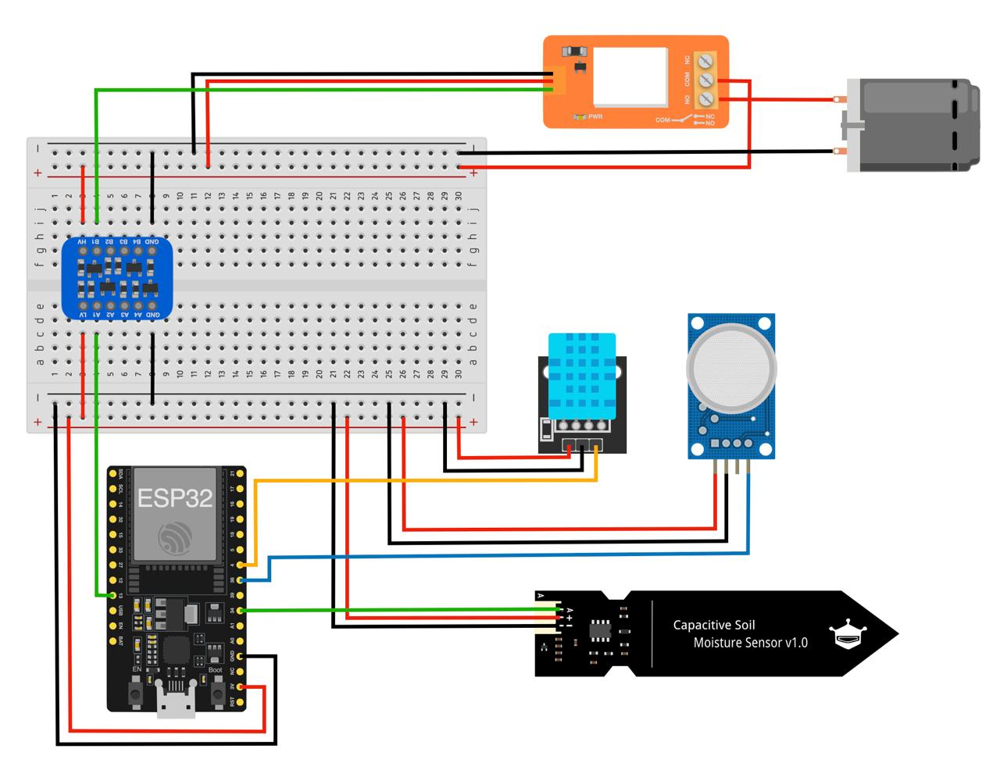

---

## Modulo ESP32
L’ESP32 è il **cuore** del sistema: si occupa di raccogliere i dati dai vari sensori e di gestire la comunicazione tramite rete Wi-Fi. I dati raccolti vengono inviati alla piattaforma **ThingsBoard** tramite protocollo MQTT.

Caratteristiche tecniche principali:
- **Processore**: Dual-core a 240 MHz.  
- **Memoria Flash**: Fino a 4 MB.  
- **Connettività**: Wi-Fi e Bluetooth integrati.  
- **I/O Multipli**: pin digitali e analogici (ADC, DAC, UART, SPI, I2C, ecc.).  
- **Alimentazione**: funziona a 3.3V con regolatori interni.  

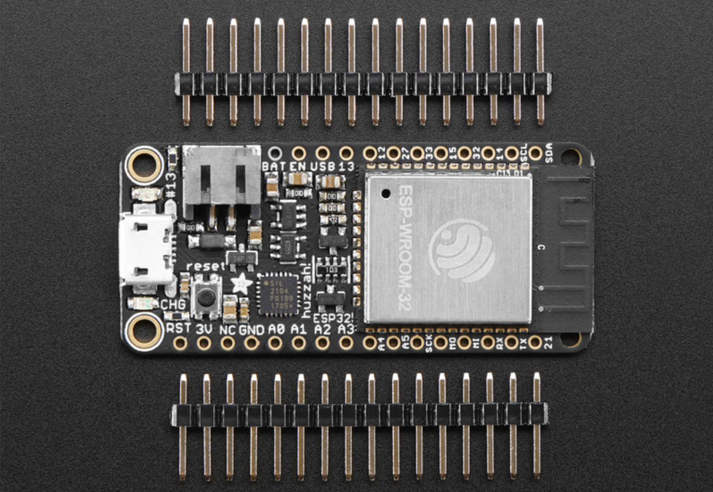

---

## Sensore di Rilevamento Fumo/Gas (MQ-135)
Il sensore **MQ-135** è impiegato per monitorare la qualità dell’aria e rilevare gas potenzialmente pericolosi, contribuendo alla protezione antincendio della serra.

- **Sensibilità multi-gas**: rileva diverse sostanze (CO₂, NH₃, e altri gas).  
- **Uscita analogica**: la tensione di uscita varia in funzione della concentrazione di gas.  
- **Tempo di risposta rapido**: consente di rilevare variazioni di concentrazione in breve tempo.  

**Schema di Collegamento Principale**  
- **Segnale**: PIN analogico (A0) del sensore collegato a un GPIO analogico dell’ESP32 (ad esempio GPIO36).  
- **Alimentazione**: 3V dall’ESP32 e GND condiviso.  

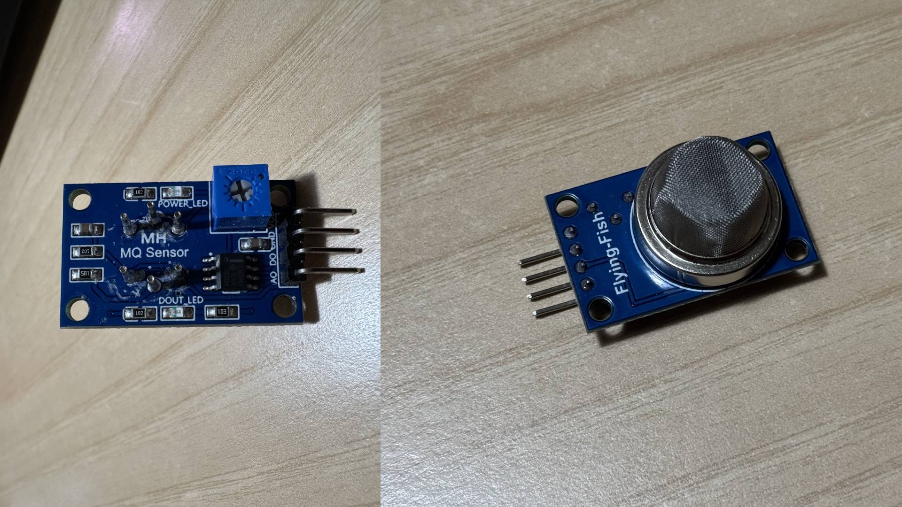

---

## Sensore di Umidità del Terreno (Moisture Soil)
Misura il livello di umidità del terreno, dato fondamentale per il controllo dell’irrigazione.

- **Uscita analogica**: tensione variabile in base al livello di umidità, restituendo un valore in percentuale.  
- **Tempo di risposta rapido**: rileva variazioni dell’umidità in breve tempo.  

**Schema di Collegamento Principale**  
- **Segnale**: collegato a un GPIO analogico dell’ESP32 (ad es. GPIO34).  
- **Alimentazione**: 3V e GND comune.  

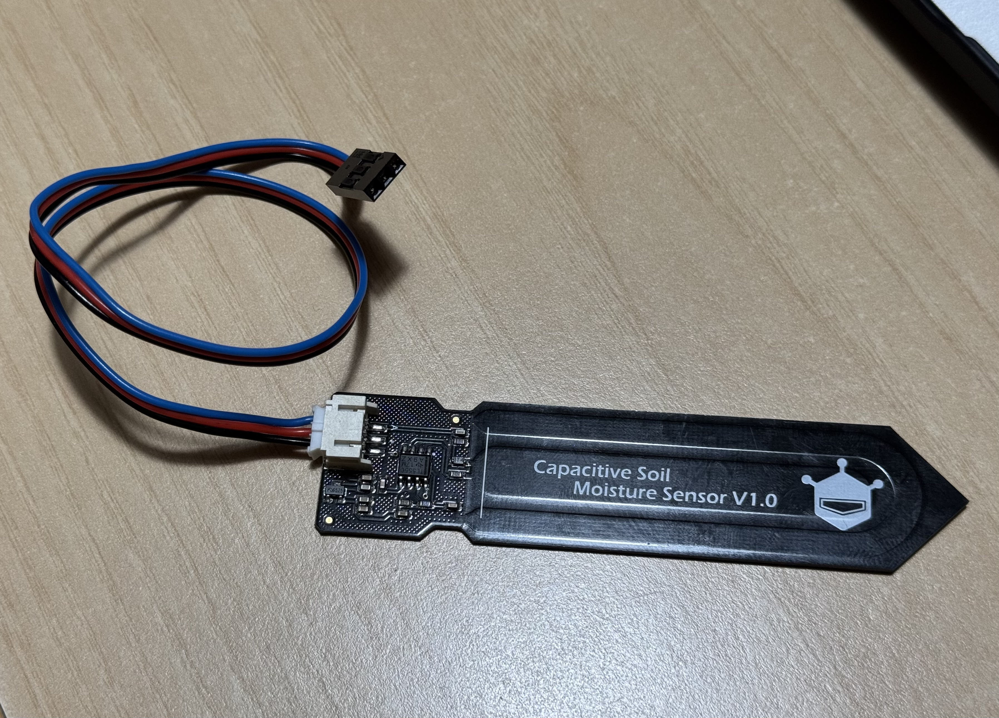

---

## Sensore di Temperatura e Umidità dell'aria (DHT11)
Il sensore **DHT11** misura sia la temperatura che l’umidità relativa dell’aria.

- **Intervallo di temperatura**: 0-50°C, con una precisione di ±2°C.  
- **Intervallo di umidità**: 20%-90%, con una precisione di ±5%.  

**Schema di Collegamento Principale**  
- **Segnale**: collegato a un GPIO dell’ESP32 (ad es. GPIO4).  
- **Alimentazione**: 3V e GND comune.  

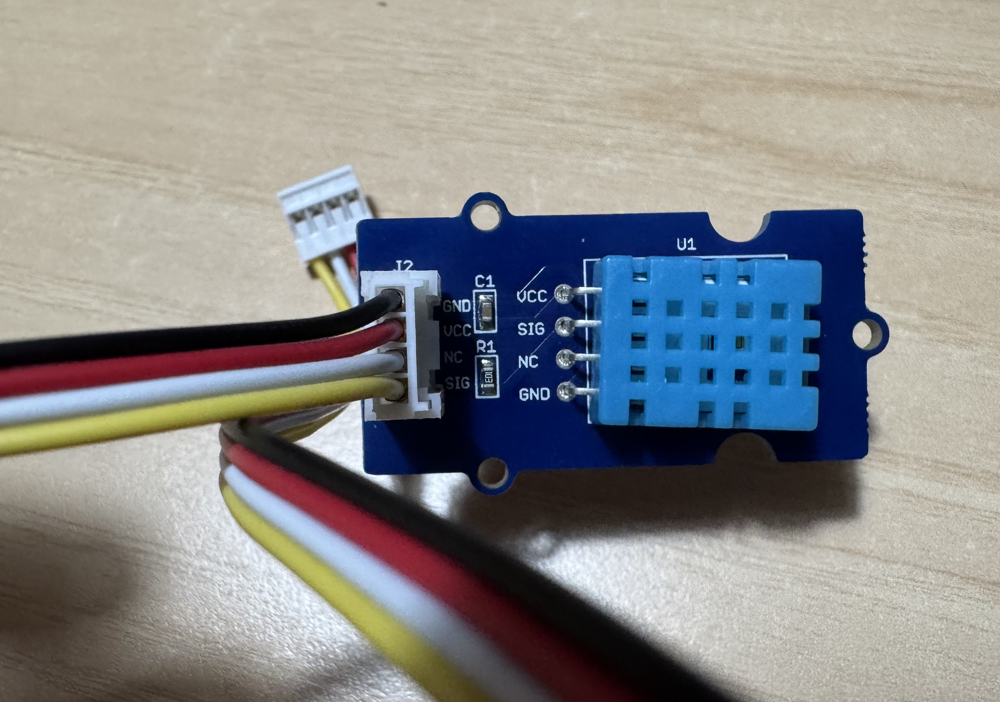

---

## Sistema di Controllo della Pompa e Relè

### Il Relè
Il relè è un dispositivo elettromeccanico dotato di:
- **Bobina** (attuata con bassa tensione).  
- **Contatti elettrici** (COM, NO, NC) per pilotare carichi più elevati.  

Quando la bobina viene alimentata, il contatto **NO** (Normally Open) si chiude, consentendo il passaggio di corrente verso la pompa.

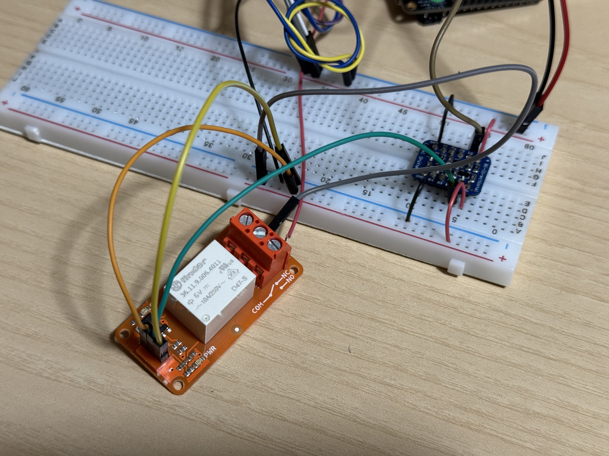

### Schema di Collegamento del Relè e della Pompa
- Il terminale **NO** del relè è collegato al **VCC** della pompa.  
- Il terminale **COM** è connesso al **GND** comune (tramite level shifter o direttamente, in base all’alimentazione).  
- **Pompa** alimentata a 5V o più (in base alle specifiche), controllata dall’azione del relè.  

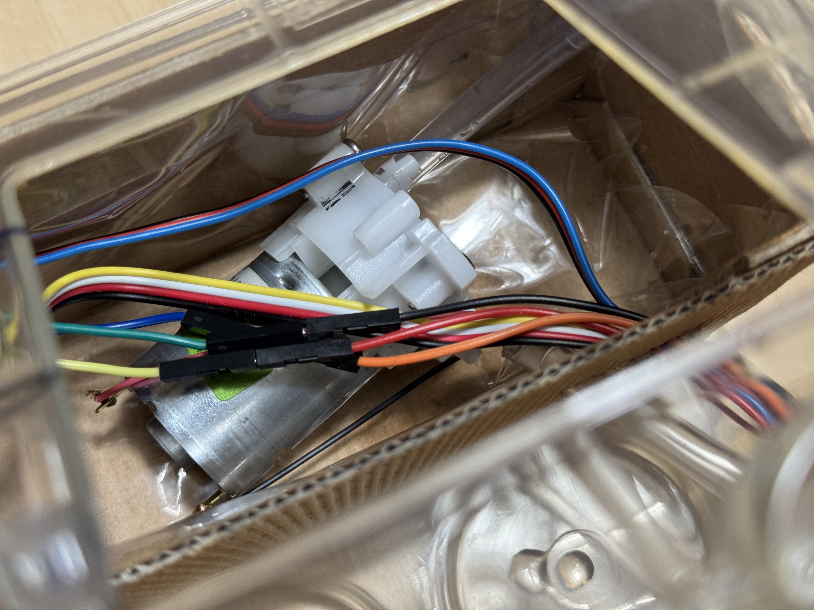

### Il Level Shifter
Permette di convertire i segnali a **3.3V** (ESP32) in segnali a **5V** per pilotare correttamente il relè:

- **Alimentazione**: lato LV (3.3V) dall’ESP32, lato HV (5V) da fonte esterna o USB. GND in comune.  
- **Segnale**: dal GPIO dell’ESP32 → LV → HV → ingresso del relè.  

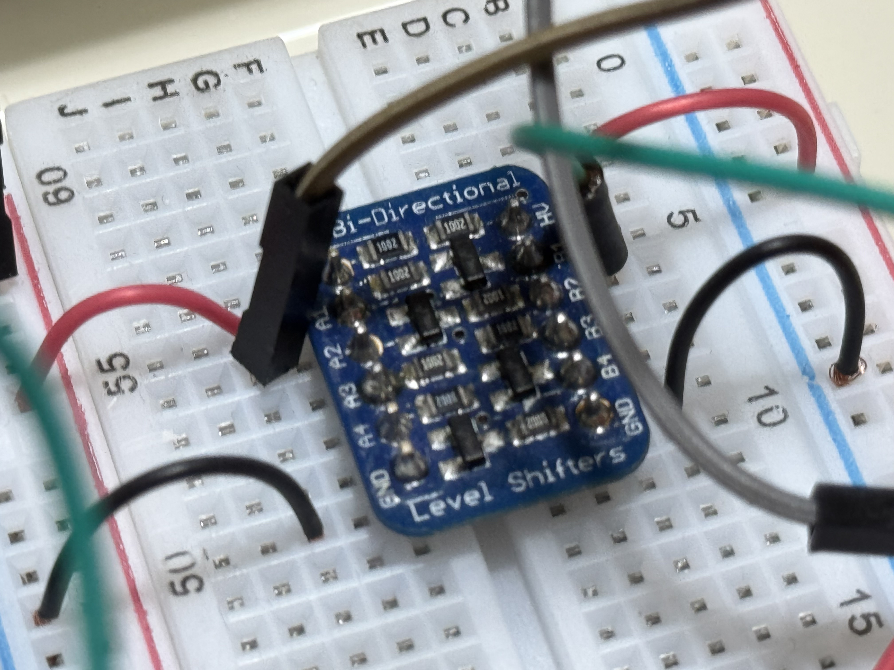

---

## Implementazione su ThingsBoard
### Setup del Dispositivo ESP32
Su ThingsBoard:
1. **Creare un nuovo Device** (es. “ESP32”).  
2. **Ottenere l’Access Token** nella sezione “Manage credentials” del dispositivo.  
3. **Inserire il Token** nel firmware dell’ESP32 per l’autenticazione MQTT.

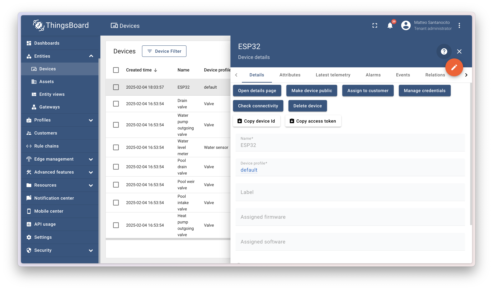

### Gestione dell’Attributo Shared
Nel progetto, un **Bot Telegram** aggiorna un attributo condiviso (“**Shared Attribute**”) su ThingsBoard, indicante la durata (in millisecondi) di attivazione della pompa:

- Creare l’attributo condiviso (chiave `pompa`) nella sezione **Shared Attributes** del device su ThingsBoard.  
- L’ESP32 si **iscrive** a questo attributo e reagisce in tempo reale ai cambiamenti.  

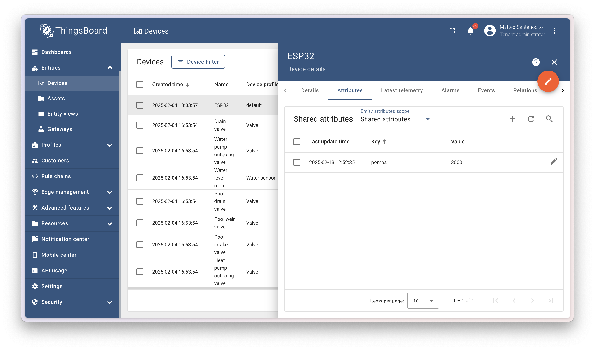

### Registrazione delle Telemetrie
ThingsBoard raccoglie e visualizza i dati di telemetria inviati dall’ESP32, ad esempio:
- `temperature`  
- `humidityAir`  
- `humiditySoil`  
- `airQuality`

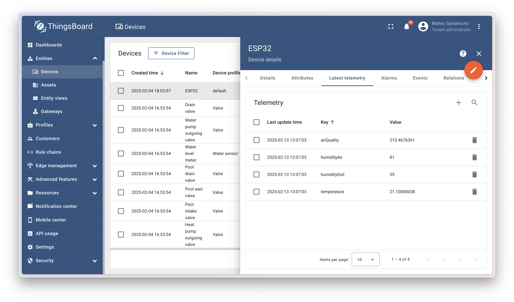

### Setup della Dashboard
Creare una **Dashboard** per visualizzare i dati:
1. Configurare la **Datasource**: selezionare il dispositivo “ESP32” e le chiavi di telemetria (ad esempio `humidityAir`, `temperature`, ecc.).  
2. Aggiungere i widget: carte, gauge, grafici storici, indicatori, ecc.  
3. Definire l’aspetto: icona, unità di misura, soglie di allarme, ecc.

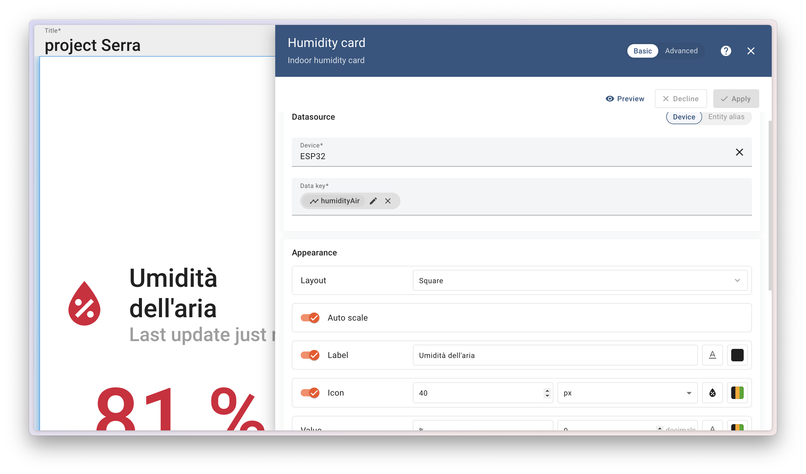

### Dashboard
Esempio di **Dashboard** con i dati in tempo reale dei sensori:

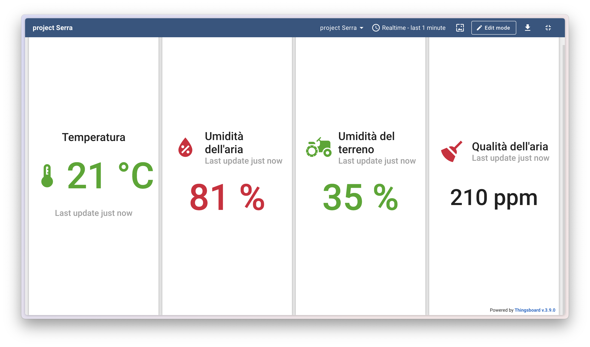

---

## Struttura del Codice ESP32 (Descrizione)
> **Nota:**  
> I file sorgente completi e commentati per l’ESP32 si trovano nel repository, nella cartella dedicata. Di seguito viene riportata **solo la logica generale** (senza codice) per evitare duplicazioni.

1. **Connessione a Wi-Fi**: inizializzazione e riconnessione in caso di disconnessione.  
2. **Connessione a ThingsBoard via MQTT**: utilizzo del token di autenticazione e invio periodico dei dati di telemetria.  
3. **Lettura Sensori**:  
   - Umidità del terreno (ingresso analogico).  
   - Temperatura e umidità dell’aria (DHT11).  
   - Qualità dell’aria (MQ-135).  
4. **Gestione della Pompa**: controllo tramite pin digitale e relè; si attiva per il tempo specificato dall’attributo condiviso.  
5. **Callback Messaggi MQTT**:  
   - Ricezione valore `pompa` e conseguente attivazione del relè.  

---

## Struttura del Codice Bot Telegram (Descrizione)
> **Nota:**  
> Il codice completo del bot è consultabile nella cartella dedicata del repository, già commentato. Di seguito una **sintesi** delle funzionalità principali.

1. **Autenticazione e Configurazione**:  
   - Token del bot di Telegram.  
   - Collegamento a ThingsBoard tramite JWT Token e Device ID.  

2. **Comandi Principali**:  
   - `/start` e `/menu`: inviano una tastiera interattiva con le opzioni “Stato serra” e “Avvia irrigazione”.  
   - `Stato serra`: mostra i dati più recenti (temperatura, umidità aria/terreno, qualità dell’aria) recuperati da ThingsBoard.  
   - `Avvia irrigazione`: chiede all’utente la durata (in secondi) per l’attivazione della pompa.  

   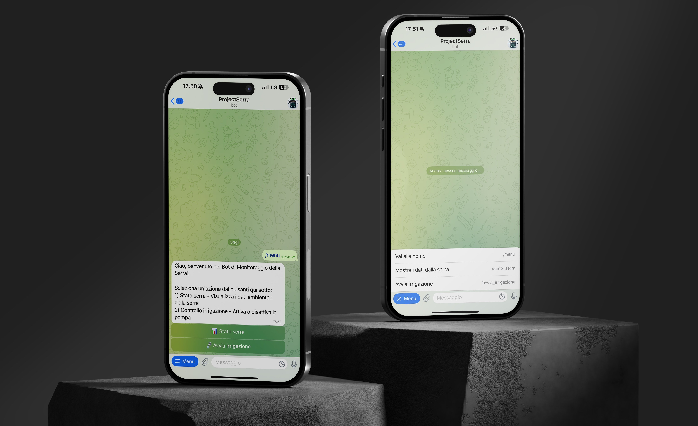


3. **Gestione Attributo Shared**:  
   - Aggiornamento dell’attributo `pompa` su ThingsBoard per avviare l’irrigazione. 

     

4. **Notifiche Automatiche**:  
   - Controllo periodico dei valori di umidità del terreno e qualità dell’aria.  
   - Se la lettura supera (o scende sotto) certe soglie, il bot invia una notifica di emergenza agli utenti attivi, offrendo anche la possibilità di avviare la pompa.  

   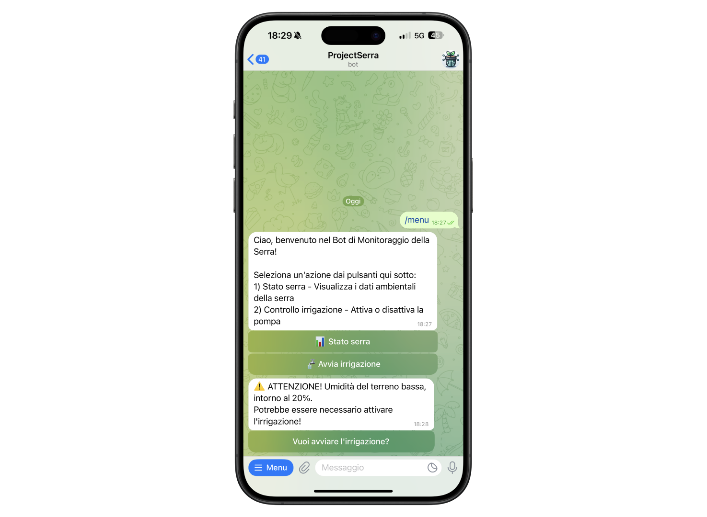 

5. **Stato Serra**:  
   - Tramite il comando Stato Serra, il bot verifica le condizioni ambientali registrate dai sensori collegati all'ESP32 e inviate a Thingsboard.  

   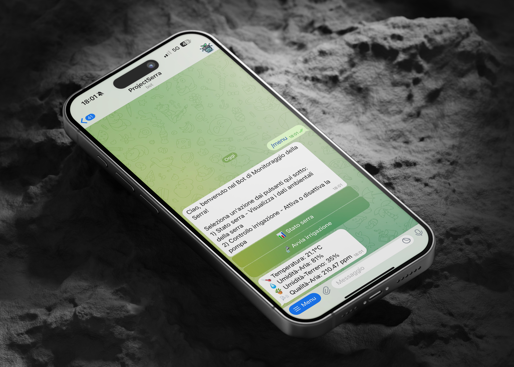 

---

### Licenza
Questo progetto è rilasciato sotto licenza libera per scopi didattici. Tutti i file sorgente e il codice sono disponibili all’interno di questo repository.

---  

**Fine README**  
```markdown